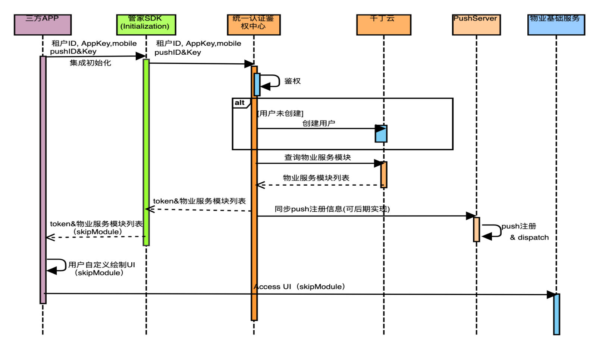

# SDK-PSM-QDingBY

## A client-optimized sdk for fast apps on any platform. (Property Services Management SDK)
PSM-SDK is:

  * **Optimized for UI**:
  Develop with a programming language specialized around the needs of user interface creation
  
  * **Platforms**:
Native development for iOS and Android, later replaced with Dart based fultter development;
(Dart Native**: For programs targeting devices (mobile, desktop, server, and more),
  Dart Native includes both a Dart VM with JIT (just-in-time) compilation and an
  AOT (ahead-of-time) compiler for producing machine code.)
  
 

## License & patents

PSM-SDK is free and open source, but commercial authorization please contact the QDM-Team.

See ...

## Using It

## Building 

## Contributing to Dart

